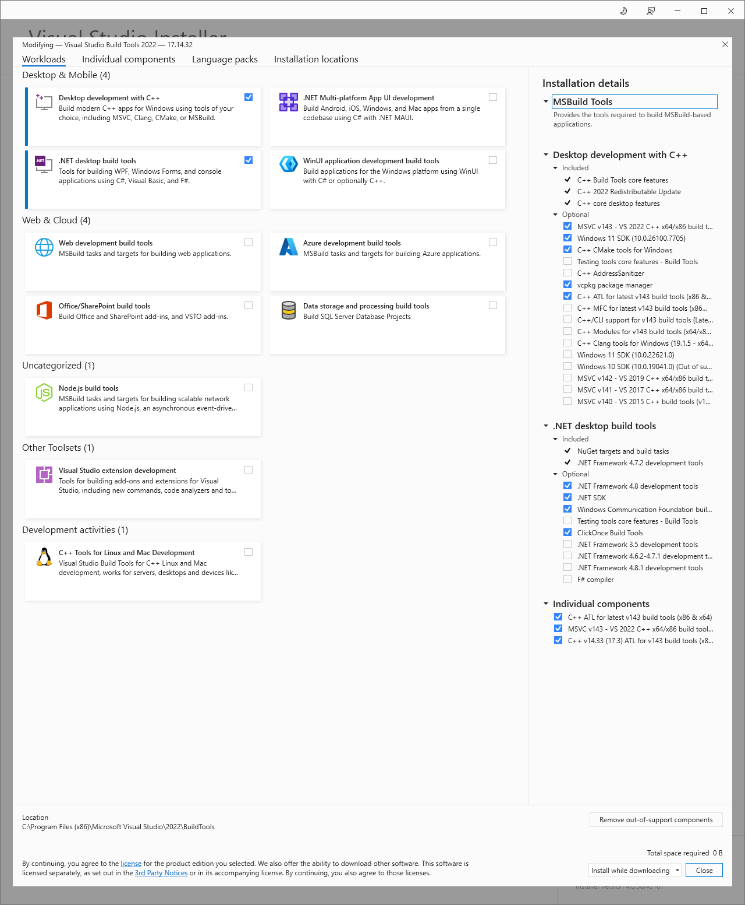

# foo_scrobble

## Overview

foo_scrobble is a foobar2000 component for scrobbling to [https://www.last.fm/](https://www.last.fm/).

- Uses the [Scrobbling 2.0 API](https://www.last.fm/api/scrobbling). You authorize the component with last.fm instead of entering your login credentials into foobar2000.
- Supports "Now Playing" notifications.
- Handles intermittent network outages or reconnects well. No "waiting for handshake" issue.
- Manages the scrobble cache automatically. There is no need to manually submit the cache.
- Allows custom tags for scrobbled details.

To get started, open foobar2000's preferences, navigate to `Tools > Last.fm Scrobbling` and use the top button to authorize your client. The button has a helpful tooltip with detailed instructions.


## Prerequisites

You may have to install [Visual C++ Redistributable for Visual Studio 2015-2022](https://aka.ms/vs/17/release/vc_redist.x86.exe). Windows 7 also requires [Update for Windows 7 (KB2999226)](https://www.microsoft.com/en-us/download/details.aspx?id=49077) which usually is already installed via Windows Update.


## Building from scratch

These steps describe a clean Windows setup using Visual Studio 2022 Build Tools.
They build both the x86 and x64 component DLLs and then package them into
`build\publish`.

### 1. Install system tools

Install the following tools and make sure they are available in `PATH`.

- [Git for Windows](https://git-scm.com/download/win), required by
  `eng\Build-Dependencies.ps1` to clone the pinned vcpkg repository.
- [PowerShell 7](https://learn.microsoft.com/powershell/scripting/install/installing-powershell-on-windows),
  required for dependency builds. The executable is `pwsh.exe`; the Start menu
  entry named `Windows PowerShell` is the older 5.1 shell and is not sufficient.
- [7-Zip](https://www.7-zip.org/), required by vcpkg package/extract steps.
- [NuGet.exe command-line client](https://www.nuget.org/downloads), required by
  `build.proj` restore. Put `nuget.exe` on `PATH`, or pass
  `/p:NuGetExecutable=C:\path\to\nuget.exe` to `msbuild`.
- [MSYS2](https://www.msys2.org/) with `pkgconf` if vcpkg reports
  `pkg-config`/MSYS2 failures while building dependencies. From an MSYS2 UCRT64
  shell:

```sh
pacman -Syu
pacman -S --needed mingw-w64-ucrt-x86_64-pkgconf
```

Winget package IDs that worked on a clean machine:

```powershell
winget install --id Git.Git -e
winget install --id Microsoft.PowerShell -e
winget install --id 7zip.7zip -e
winget install --id Microsoft.NuGet -e
```

After installing the tools, a fresh Developer PowerShell should find them:

```powershell
where.exe git
where.exe pwsh
where.exe 7z
where.exe nuget
pwsh -NoProfile -Command '$PSVersionTable.PSVersion'
```

### 2. Install Visual Studio 2022 Build Tools

Install [Visual Studio 2022 Build Tools](https://visualstudio.microsoft.com/downloads/).
Run the installer from an elevated shell if Windows asks for administrator
rights. In the Visual Studio Installer, select:



- Workloads:
  - `Desktop development with C++`
  - `.NET desktop build tools`
- Individual components:
  - `MSVC v143 - VS 2022 C++ x64/x86 build tools`
  - `C++ ATL for latest v143 build tools (x86 & x64)`
  - `Windows 11 SDK (10.0.26100)`
  - `C++ CMake tools for Windows`
  - `vcpkg package manager`
  - `.NET Framework 4.8 development tools`
  - `.NET SDK`
  - `Windows Communication Foundation build tools`
  - `ClickOnce Build Tools`

The project files use `WindowsTargetPlatformVersion=10.0`, but the installer
selection used here is the Windows 11 SDK. Do not select the out-of-support
Windows SDK entry shown in the installer. Newer .NET SDKs such as .NET 9 can
build the included `net6.0-windows` helper project, though they emit warnings
that `net6.0-windows` is out of support.

Equivalent unattended install example, using the component IDs from Microsoft's
[Visual Studio Build Tools component directory](https://learn.microsoft.com/visualstudio/install/workload-component-id-vs-build-tools?view=vs-2022):

```powershell
$vsArgs = @(
  '--wait'
  '--passive'
  '--norestart'
  '--add Microsoft.VisualStudio.Workload.VCTools'
  '--add Microsoft.VisualStudio.Workload.ManagedDesktopBuildTools'
  '--add Microsoft.VisualStudio.Component.VC.Tools.x86.x64'
  '--add Microsoft.VisualStudio.Component.VC.ATL'
  '--add Microsoft.VisualStudio.Component.Windows11SDK.26100'
  '--add Microsoft.VisualStudio.Component.VC.CMake.Project'
  '--add Microsoft.VisualStudio.Component.Vcpkg'
  '--add Microsoft.Net.ComponentGroup.4.8.DeveloperTools'
  '--add Microsoft.NetCore.Component.SDK'
  '--add Microsoft.VisualStudio.Wcf.BuildTools.ComponentGroup'
  '--add Microsoft.Component.ClickOnce.MSBuild'
) -join ' '

winget install --id Microsoft.VisualStudio.2022.BuildTools -e --override $vsArgs
```

The ATL component is required. Without it, the build fails with:

```text
fatal error C1083: Cannot open include file: 'atlbase.h': No such file or directory
```

This repository was validated with Visual Studio 2022 Build Tools 17.14. A
newer preview/next Visual Studio installation can be present side-by-side, but
the pinned vcpkg version is happiest when the active build environment is the
2022 one. Verify with:

```powershell
& "${env:ProgramFiles(x86)}\Microsoft Visual Studio\Installer\vswhere.exe" `
  -version "[17.3,18.0)" -products * -property installationPath
```

The output should include a path like:

```text
C:\Program Files (x86)\Microsoft Visual Studio\2022\BuildTools
```

### 3. Open the correct shell

Use `Visual Studio 2022 Developer PowerShell`, not a plain PowerShell window.
Then verify that MSBuild, the compiler, linker tools, PowerShell 7, NuGet,
7-Zip, and ATL are visible:

```powershell
where.exe msbuild
where.exe cl
where.exe dumpbin
where.exe pwsh
where.exe nuget
where.exe 7z
Get-ChildItem "${env:ProgramFiles(x86)}\Microsoft Visual Studio\2022\BuildTools\VC\Tools\MSVC" -Recurse -Filter atlbase.h |
  Select-Object -First 5 -ExpandProperty FullName
```

Expected paths are under `...\Microsoft Visual Studio\2022\BuildTools\...`.
If Developer PowerShell prints an execution policy warning about a profile
script, that is usually harmless for this build because the commands below use
`-NoProfile -ExecutionPolicy Bypass`.

### 4. Build and install native dependencies

External native dependencies are consumed through the `foo_scrobble-deps`
NuGet package. The solution currently expects `foo_scrobble-deps` version
`2.0.0` in `src\packages`.

From the repository root:

```powershell
Remove-Item Env:VCPKG_ROOT -ErrorAction SilentlyContinue
Remove-Item Env:VCPKG_DEFAULT_TRIPLET -ErrorAction SilentlyContinue
Remove-Item Env:VCPKG_DEFAULT_HOST_TRIPLET -ErrorAction SilentlyContinue

$env:VCPKG_FORCE_SYSTEM_BINARIES = "1"
$env:Path = "C:\Program Files\7-Zip;$env:Path"

pwsh -NoProfile -ExecutionPolicy Bypass -File .\eng\Build-Dependencies.ps1 `
  -Clean:$false -Install -NoBinaryCache -Verbose
```

The script:

- clones the pinned `gix/vcpkg` revision into `artifacts\vcpkg`;
- builds `cpprestsdk[core]`, `fmt`, `outcome`, and `wtl`;
- exports them for `x86-windows-static-md-noiso` and
  `x64-windows-static-md-noiso`;
- installs `foo_scrobble-deps.2.0.0` into `src\packages`.

Use `pwsh`, not Windows PowerShell 5.1, for this script. Running it under 5.1
can fail early with `Join-Path` argument errors while creating the custom
triplet files.

`VCPKG_FORCE_SYSTEM_BINARIES=1`, the 7-Zip path, and `-NoBinaryCache` avoid
old helper downloads from the pinned vcpkg toolchain, including stale portable
7-Zip packages that no longer exist upstream.

If vcpkg fails inside the `fmt` port with a stale `pkg-config`/MSYS2 check, edit
`artifacts\vcpkg\ports\fmt\portfile.cmake` and change:

```cmake
vcpkg_fixup_pkgconfig()
```

to:

```cmake
vcpkg_fixup_pkgconfig(SKIP_CHECK)
```

That skips the optional pkg-config validation that tries to download old MSYS2
packages from stale mirrors. Setting `PKG_CONFIG` to an MSYS2 `pkg-config.exe`
may help on some machines, but the local `fmt` port edit above is the
workaround that avoided the stale download in this setup.

Then rerun:

```powershell
pwsh -NoProfile -ExecutionPolicy Bypass -File .\eng\Build-Dependencies.ps1 `
  -Clean:$false -Install -NoBinaryCache -Verbose
```

Keep `-Clean:$false` when rerunning after a local vcpkg port edit, otherwise
the `artifacts` directory can be recreated and the edit lost. The `artifacts`
and `build` directories are ignored by Git and can be deleted if you need to
start the dependency build over intentionally.

After dependencies install, confirm all project package references point to the
same generated package version:

```powershell
$packageConfigs = @(
  '.\src\foo_scrobble\packages.config'
  '.\sdk\libPPUI\packages.config'
  '.\sdk\foobar2000\helpers\packages.config'
)

Select-String -Path $packageConfigs -Pattern 'foo_scrobble-deps'
```

Each line should show `version="2.0.0"`. If any of them still says `1.0.0`,
NuGet restore will look for a package that no longer matches the dependency
build output.

### 5. Build the component package

Before building, clear global vcpkg environment variables. A machine-wide vcpkg
installation can override the solution's NuGet-provided vcpkg package and cause
the wrong triplet or include paths to be used.

```powershell
Remove-Item Env:VCPKG_ROOT -ErrorAction SilentlyContinue
Remove-Item Env:VCPKG_DEFAULT_TRIPLET -ErrorAction SilentlyContinue
Remove-Item Env:VCPKG_DEFAULT_HOST_TRIPLET -ErrorAction SilentlyContinue
```

Build from the repository root:

```powershell
msbuild -m build.proj
```

This runs clean, restore, x86 build, x64 build, and packaging. Successful output
ends with files like:

```text
build\publish\foo_scrobble-<VERSION>.fb2k-component
build\publish\foo_scrobble-<VERSION>.zip
```

The `.fb2k-component` contains the foobar2000 component DLLs. The `.zip`
contains the same DLLs plus symbols.

### Common build notes

- `NETSDK1138` for `net6.0-windows` is expected with current .NET SDKs. It is a
  support-lifecycle warning for the included `LastfmApiStub` helper project.
- `NETSDK1201` can appear with newer .NET SDKs because the stub project uses a
  `RuntimeIdentifier`. It is a warning only.
- Deprecation warnings from the bundled foobar2000 SDK, `pfc`, or `libPPUI`
  are expected.
- If `nuget.exe` is not on `PATH`, either add it or run
  `msbuild -m build.proj /p:NuGetExecutable=C:\path\to\nuget.exe`.
- If `pwsh.exe` is missing, install PowerShell 7 and reopen the Developer
  PowerShell.
- If vcpkg cannot find the custom `noiso` triplets, clear `VCPKG_ROOT`,
  `VCPKG_DEFAULT_TRIPLET`, and `VCPKG_DEFAULT_HOST_TRIPLET`, then rerun the
  command from the repository root so the local `artifacts\vcpkg` checkout is
  used.
- If vcpkg says it cannot find a valid Visual Studio instance, or probes a
  missing `dumpbin.exe`, open `Visual Studio 2022 Developer PowerShell` and
  verify `where.exe cl` and `where.exe dumpbin` point under the 2022 Build Tools
  installation.
- If `atlbase.h` is missing, reopen the Visual Studio Installer and add
  `C++ ATL for latest v143 build tools (x86 & x64)`.
- If vcpkg fails while downloading old MSYS2/pkg-config helper packages during
  the `fmt` build, apply the `vcpkg_fixup_pkgconfig(SKIP_CHECK)` edit above and
  rerun with `-Clean:$false`.

## License

Code licensed under the [MIT License](LICENSE.txt).
